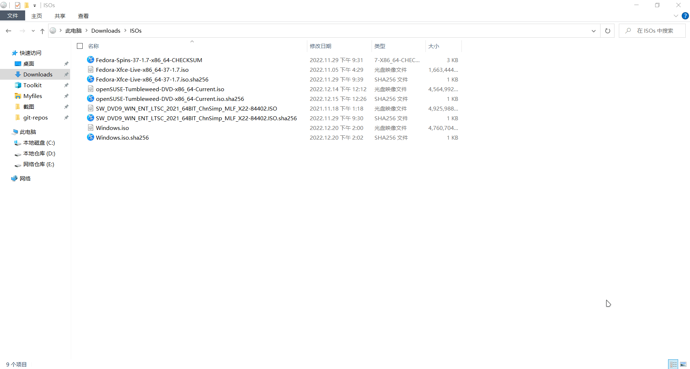

# 校验文件

!!! note "注意"

    - 本文主要描述如何快速地校验文件，有关 GPG 的更多信息详见：<https://gnupg.org/>；
    - 有关哈希函数的详细介绍另见：<https://en.wikipedia.org/wiki/Hash_function>
    - 本文假定读者仍在使用 Windows。

虽然 ISO 文件损坏的情况很少发生，但计算 ISO 文件的校验并与官方的校验和进行对比，同时验证一下 ISO 的签名是否被篡改并非多此一举。

如果你觉得检验文件很繁琐，可以直接跳转到下一篇文本

所需的工具：

- [7-zip](https://www.7-zip.org/)
- [GnuPG](https://gnupg.org/)
- 文本编辑器

<center>


</center>

## 下载校验文件

=== "openSUSE"

    - 安装镜像：[openSUSE Tumbleweed (x86_64, DVD)](https://opentuna.cn/opensuse/tumbleweed/iso/openSUSE-Tumbleweed-DVD-x86_64-Current.iso) [约 4.7GB]
    - ISO 文件校验文件：[ISO Cheksum](https://opentuna.cn/opensuse/tumbleweed/iso/openSUSE-Tumbleweed-DVD-x86_64-Current.iso.sha256)
    - ISO 签名文件：[ISO signature](https://opentuna.cn/opensuse/tumbleweed/iso/openSUSE-Tumbleweed-DVD-x86_64-Current.iso.sha256.asc)

=== "Fedora"

    - 安装镜像：[Fedora 37 (x86_64, Workstation)](https://opentuna.cn/fedora/releases/37/Workstation/x86_64/iso/Fedora-Workstation-Live-x86_64-37-1.7.iso) [约 2GB]
    - ISO 文件校验文件：[ISO Cheksum](https://opentuna.cn/fedora/releases/37/Workstation/x86_64/iso/Fedora-Workstation-37-1.7-x86_64-CHECKSUM)

通过上述链接，你会获得如下三个或两个文件：

```
Fedora-Workstation-37-1.7-x86_64-CHECKSUM
Fedora-Workstation-Live-x86_64-37-1.7.iso

openSUSE-Tumbleweed-DVD-x86_64-Current.iso
openSUSE-Tumbleweed-DVD-x86_64-Current.iso.sha256
openSUSE-Tumbleweed-DVD-x86_64-Current.iso.sha256.asc
```

请将它们放置在同一个文件夹之中。

## 初始化 GnuPG

### 安装

你需要先下载适用于 Windows 系统的 [Gpg4win](https://gpg4win.org/download.html)，然后根据提示安装 Gpg4win。

!!! note "注意"

    - 下载站点会请求你对 Gpg4win 项目进行捐款，你可以使用页面上提示的支付方式进行赞助 Gpg4win 项目的运营；或者选择 0$ 直接下载安装包。
    - 如果你不清楚你在做什么，直接遵循 Gpg4win 安装程序的默认推荐值即可。

### 获取公钥

Gpg4win 安装完成后，打开开始菜单，找到并启动名为 Kleopatra 的应用程序：


点击**新建密钥对**，输入你的名字和邮件地址，点击 **OK** 确认生成密钥对，例如：


然后点击设置，选择**配置 Kleopatra**，在 **S/MIME 校验**中设定好 http 代理地址：

!!! tip "网络代理"

    你也可以直接在代理软件中开启系统代理。


点击此页面上方的**在服务器上查找**，然后在弹出的对话框中输入 “openSUSE”，找到并导入 *`openSUSE Project Signing Key<opensuse@opensuse.org>`*：


同样地，以相似的步骤导入来自 *`fedora(37)<fedora-37-primary@fedoraproject.org>`*[^1] 的公钥。

上述方法是有关于如何从 Kleopatra 内置的 key 服务器地址[^2][^3]获取公钥。当你需要添加某人或项目的公钥的时候，最好向本人直接索取或前往官网查找密钥。导入密钥的时候，记得对比一下导入的密钥指纹（Key fingerprint）和公钥发布者给出的密钥指纹是否吻合。

同时，需要注意的一点是，[openSUSE 项目已经将公钥更新为 4096 位 RSA 签名密钥](https://suse.org.cn/%E7%A4%BE%E5%8C%BA%E6%96%B0%E9%97%BB/2023/01/22/Tumbleweed-%E7%9A%84%E6%96%B0-4096-%E4%BD%8D-RSA-%E7%AD%BE%E5%90%8D%E5%AF%86%E9%92%A5.html)，Tumbleweed 已经采用了新的公钥，但 [Leap](https://get.opensuse.org/leap/) 当前还在使用旧的密钥。

你可以将下面的 OpenPGP 密钥信息保存至一个纯文本文档，然后再导入至 Kleopatra 中，或者直接前往 [openSUSE 官网](https://get.opensuse.org/tumbleweed/)，你会在页面底部看到公钥下载链接。

=== "公钥信息"

    ```
    pub   rsa4096/0x35A2F86E29B700A4 2022-06-20 [SC] [expires: 2026-06-19]
          Key fingerprint = AD48 5664 E901 B867 051A  B15F 35A2 F86E 29B7 00A4
    uid   openSUSE Project Signing Key <opensuse@opensuse.org>
    ```

=== "OpenPGP 公钥文件"

    ```
    -----BEGIN PGP PUBLIC KEY BLOCK-----
    Version: GnuPG v2.0.15 (GNU/Linux)

    mQINBGKwfiIBEADe9bKROWax5CI83KUly/ZRDtiCbiSnvWfBK1deAttV+qLTZ006
    090eQCOlMtcjhNe641Ahi/SwMsBLNMNich7/ddgNDJ99H8Oen6mBze00Z0Nlg2HZ
    VZibSFRYvg+tdivu83a1A1Z5U10Fovwc2awCVWs3i6/XrpXiKZP5/Pi3RV2K7VcG
    rt+TUQ3ygiCh1FhKnBfIGS+UMhHwdLUAQ5cB+7eAgba5kSvlWKRymLzgAPVkB/NJ
    uqjz+yPZ9LtJZXHYrjq9yaEy0J80Mn9uTmVggZqdTPWx5CnIWv7Y3fnWbkL/uhTR
    uDmNfy7a0ULB3qjJXMAnjLE/Oi14UE28XfMtlEmEEeYhtlPlH7hvFDgirRHN6kss
    BvOpT+UikqFhJ+IsarAqnnrEbD2nO7Jnt6wnYf9QWPnl93h2e0/qi4JqT9zw93zs
    fDENY/yhTuqqvgN6dqaD2ABBNeQENII+VpqjzmnEl8TePPCOb+pELQ7uk6j4D0j7
    slQjdns/wUHg8bGE3uMFcZFkokPv6Cw6Aby1ijqBe+qYB9ay7nki44OoOsJvirxv
    p00MRgsm+C8he+B8QDZNBWYiPkhHZBFi5GQSUY04FimR2BpudV9rJqbKP0UezEpc
    m3tmqLuIc9YCxqMt40tbQOUVSrtFcYlltJ/yTVxu3plUpwtJGQavCJM7RQARAQAB
    tDRvcGVuU1VTRSBQcm9qZWN0IFNpZ25pbmcgS2V5IDxvcGVuc3VzZUBvcGVuc3Vz
    ZS5vcmc+iQI+BBMBAgAoBQJisH4iAhsDBQkHhM4ABgsJCAcDAgYVCAIJCgsEFgID
    AQIeAQIXgAAKCRA1ovhuKbcApKRrEACJMhZhsPJBOkYmANvH5mqlk27brA3IZoM4
    8qTzERebzKa0ZH1fgRI/3DhrfBYL0M5XOb3+26Ize0pujyJQs61Nlo1ibtQqCoyu
    dvP/pmY1/Vr374wlMFBuCfAjdad4YXkbe7q7GGjo6cF89qtBfTqEtaRrfDgtPLx/
    s9/WXLGo0XYqCCSPVoU66jQYNcCt3pH+hqytvntXJDhU+DveOnQCOSBBHhCMST3E
    QvriN/GnHf+sO19UmPpyHH0TM5Ru4vDrgzKYKT/CzbllfaJSk9cEuTY8Sv1sP/7B
    Z7YvOE0soIgM1sVg0u3R/2ROx0MKoLcq7EtLw64eE+wnw9bHYZQNmS+J/18p7Bo8
    I7e+8WRi+m/pus5FEWsIH1uhxKLgJGFDTHHGZtW+myjnUzXVIkpJGrKoolzYjHdK
    lRYM2fVuNI1eq6CZ6PFXg2UxovVczSnGMO33HZE09vpgkRDBrw1vF0o/Wnm02kig
    V6xYHk5wJx8vL74wPvCbw73UNT9OSdxYAz7JPqGOD6cpKe7XcAH2sYmlGpggAIUz
    Rq/lROEF5lx4SxB838JU4ezxD++BJXfBTE8JZmlGscXv74y9nCtSOZza8KOKj8ou
    WRl739FMnx9jRd7HHj3TIyymoveODnZ7f3IElyyFsjBW3XuQ9XfpZrIkwHuaZV5M
    6q2h+hgWNQ==
    =nMh8
    -----END PGP PUBLIC KEY BLOCK-----
    ```

### 验证签名

点击 Kleopatra 菜单栏上的**解密/校验**，选择对应的 sha256 文件或者 CHECKSUM 文件，进行校验：


## 校验哈希值

!!! attention "注意"

    - 请不要修改 SHA256 值，直接复制黏贴即可；
    - 文件名必须和要校验的文件的文件名保持一致；
    - sha256 文件必须和要校验的文件处于同一个文件夹中。

此处推荐使用 [7-zip](https://www.7-zip.org/) 对文件进行校验。

选中已下载的 sha256 文件，在鼠标右键菜单中，使用 **CRC SHA** 菜单中的**测试压缩包：校验和**功能，如下：

!!! tip "注意"

    如果你没有看到相似的选项，你可能需要在 7-zip 的设置（工具→选项→7-Zip）中，取消勾选**层叠右键菜单**。



对于 `Fedora-Workstation-37-1.7-x86_64-CHECKSUM`，它的本质是一个纯文本文件，你可以使用编辑器打开它，然后把其中你需要的部分复制黏贴到一个新建的，以 `sha256` 为后缀名的纯文本文件中，例如：

```
# Fedora-Workstation-Live-x86_64-37-1.7.iso: 2037372928 bytes
SHA256 (Fedora-Workstation-Live-x86_64-37-1.7.iso) = 9c69005baafdba6e4ff04c1cf4779121b7fc9aacab80b4633394576da336a515
```

然后将如上的文件修改为（SHA256 值 + 文件名）：

```
9c69005baafdba6e4ff04c1cf4779121b7fc9aacab80b4633394576da336a515  Fedora-Workstation-Live-x86_64-37-1.7.iso
```

[^1]: Fedora 37 的公钥
[^2]: <https://keyserver.ubuntu.com/>
[^3]: 除了 Ubuntu 的密钥服务器，你可以前往 <https://keys.openpgp.org/> 下载公钥。